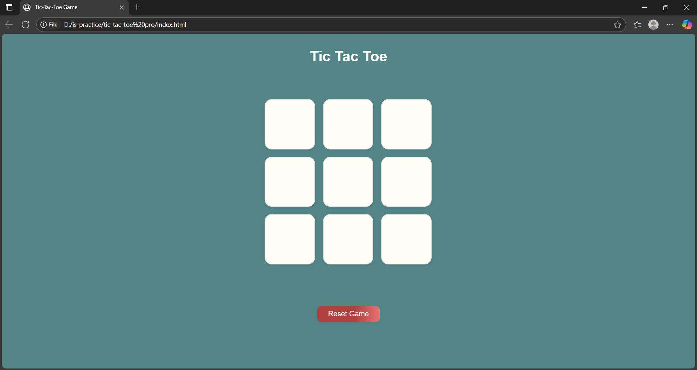

# tic-tac-toe-game
A simple, mobile-responsive Tic Tac Toe game built with HTML, CSS, and JavaScript.

## Features

- Classic 3x3 grid gameplay
- Two-player turn-based logic (X and O)
- Win and draw detection with alerts
- New Game and Reset buttons for game control
- Clean and modern design with smooth hover and click effects
- Responsive layout that works well on desktop and mobile devices
- Cursor changes to pointer on clickable elements for better user experience

## How to Use

1. Open `index.html` in any modern web browser.
2. Click on any empty cell to place your mark (X or O).
3. The game will automatically detect wins or draws.
4. Use the "New Game" button to start fresh or "Reset" to clear the board.

## Technologies Used

- HTML for the page structure
- CSS for styling and responsive layout
- JavaScript for game logic and interactivity

- 

## License

This project is licensed under the MIT License.

---

Feel free to customize or ask if you want me to add sections like screenshots, live demo links, or contribution guidelines!
